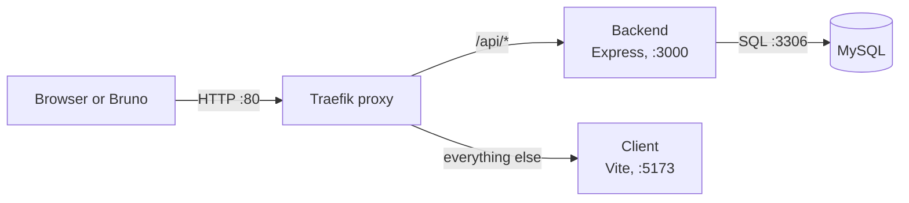

# Exploring the Todo App API by Hand (with Bruno)

> **Who this is for:** someone who has never sent an HTTP request by hand and has never
> read an Express handler. No prior API experience assumed.
>
> **Time:** 2–3 hours, unhurried. Do not speed-run it.

---

## What you will be able to do at the end

1. Explain what happens between a browser click and a row in a database, naming every hop.
2. Send any HTTP request by hand — method, URL, headers, body — without a frontend.
3. Read an Express route handler and predict its response before running it.
4. Find at least four real defects in this API, with evidence.

That last one is the real goal. **Anyone can make a request that works. Understanding an
API means knowing how it breaks.**

---

## Ground rule: predict before you run

For every request in this guide, you will write down what you *think* will come back
**before** you press send. Then you send it and compare.

This is not busywork. The gap between your prediction and the actual response is the only
place where learning happens. If you skip the prediction step, you are watching a demo,
not learning.

There are tables throughout to record your answers. Fill them in.

---

# Stage 0 — The mental model

Before touching anything, understand that this app is **four separate programs** talking
over a network. It is not "a website."



**Traefik is the piece nobody expects.** Nothing in this app listens on port 80 except the
proxy. It looks at the path of every incoming request and decides where to forward it.
The rules live in `compose.yaml`:

| Request | Goes to | Rule defined at |
| --- | --- | --- |
| `localhost/api/...` | backend, port 3000 | `compose.yaml:88` |
| `localhost/...` (anything else) | client, port 5173 | `compose.yaml:118` |
| `db.localhost` | phpMyAdmin | `compose.yaml:173` |

Why does this matter? Open `client/src/components/TodoListCard.jsx:9`. The frontend calls:

```js
fetch('/api/items')
```

No hostname. No port number. To the browser, the API lives at the same origin as the page,
so there is no CORS involved at all. The proxy is creating that illusion, and it is the
same illusion production uses. **Many developers lose hours to CORS errors caused by a
setup this one deliberately avoids. Know why it is absent here.**

### Which database is actually running?

Look at `backend/src/persistence/index.js` — the whole file is two lines:

```js
if (process.env.MYSQL_HOST) module.exports = require('./mysql');
else module.exports = require('./sqlite');
```

The backend picks its database driver at import time from an environment variable. And
`compose.yaml:73` sets `MYSQL_HOST: mysql`.

**So under Docker Compose, this app uses MySQL — never SQLite.** SQLite is the fallback for
running the backend bare on your machine. Keep that in mind; some experiments later behave
differently depending on the driver.

---

# Stage 1 — Start the app

From the repository root:

```bash
docker compose up --watch
```

The first run downloads images and builds — it takes a few minutes. Wait for a log line
like `Connected to mysql db at host mysql` (printed by `backend/src/persistence/mysql.js:46`).

Now verify each layer independently, in this order. **If a layer is broken, do not proceed
to the next — you would be debugging the wrong thing.**

| Check | Where | Expected |
| --- | --- | --- |
| Frontend loads | http://localhost | The todo app UI |
| API responds | http://localhost/api/items | `[]` or a JSON array |
| Database is reachable | http://db.localhost | phpMyAdmin, already logged in |

In phpMyAdmin, open the `todos` database → `todo_items` table. Leave that tab open. You
are going to watch rows appear and change as you send requests. **Seeing the data move is
the point.**

To stop everything later: `docker compose down`.

---

# Stage 2 — Set up Bruno

## Why Bruno and not Postman

Bruno stores your requests as **plain text files inside the repository**. That means they
are diffable, reviewable, and committable like any other code. No cloud account, no login,
no syncing your company's endpoints to someone else's server.

That property is the whole reason to prefer it. An API client whose collections live in
somebody's cloud is a collection you cannot code-review.

## Install

Download from [usebruno.com](https://www.usebruno.com/) or:

```bash
# Windows
winget install Bruno.Bruno

# macOS
brew install bruno
```

## Create the collection

In Bruno: **Create Collection** → name it `todo-app-api` → set the location to the
`docs/` folder of this repository.

Bruno will create a folder containing a `bruno.json` file. That file is the collection —
its presence is what makes a directory a Bruno collection.

## Create an environment

An **environment** is a named set of variables. You use it so the hostname appears in
exactly one place instead of being copy-pasted into fifteen requests. When you later point
the same collection at staging, you change one value, not fifteen.

In Bruno's sidebar: **Environments** → **Configure** → **Create** → name it `local`, then
add one variable:

| Name | Value |
| --- | --- |
| `baseUrl` | `http://localhost` |

Bruno writes this to `environments/local.bru`:

```bru
vars {
  baseUrl: http://localhost
}
```

**Select the `local` environment in the top-right dropdown.** If you forget this,
`{{baseUrl}}` resolves to nothing and every request fails with a confusing error. It is
the single most common Bruno mistake.

## Understanding the `.bru` file format

Every request is one `.bru` file. Here is the shape:

```bru
meta {
  name: Create Item
  type: http
  seq: 3
}

post {
  url: {{baseUrl}}/api/items
  body: json
  auth: none
}

body:json {
  {
    "name": "Buy milk"
  }
}
```

- `meta` — display name and ordering (`seq`) in the sidebar.
- `post` / `get` / `put` / `delete` — the HTTP method, holding the URL and which body type is active.
- `body:json` — the request body. A request can define several body blocks; only the one named in `body:` is sent.
- `{{baseUrl}}` — variable substitution from the selected environment.

You can build requests through the GUI and read the generated file afterwards, or write the
files by hand and watch them appear in Bruno. **Do both at least once.** Understanding that
the GUI is only an editor for text files is worth more than any button you will learn.

---

# Stage 3 — The five endpoints

The entire API surface is declared in `backend/src/index.js:13-17`. Five lines:

```js
app.get('/api/greeting', getGreeting);
app.get('/api/items', getItems);
app.post('/api/items', addItem);
app.put('/api/items/:id', updateItem);
app.delete('/api/items/:id', deleteItem);
```

Each handler is a separate small module in `backend/src/routes/`. Read the handler **before**
sending each request. Every section below follows the same rhythm: read, predict, send, compare.

---

## 3.1 — `GET /api/greeting`

The simplest possible endpoint. Start here to confirm your setup works.

**The handler** — `backend/src/routes/getGreeting.js`:

```js
const GREETING = 'Hello world!';

module.exports = async (req, res) => {
    res.send({ greeting: GREETING });
};
```

Three things to notice, and they apply to every handler in this codebase:

1. A handler is **a function taking `(req, res)`**. `req` is the incoming request, `res` is
   how you write the response. That is the entire Express model.
2. It **ignores `req` completely.** No input, so the response never changes.
3. `res.send()` with an object serializes it to JSON and sets `Content-Type:
   application/json` automatically. Express is doing work on your behalf here — notice
   what is implicit, because in a stricter framework you declare it.

**Build it in Bruno:** new request, name `Get Greeting`, method `GET`,
URL `{{baseUrl}}/api/greeting`.

**Predict, then send:**

| Question | Your prediction | Actual |
| --- | --- | --- |
| Status code? | | |
| Response body? | | |
| `Content-Type` header? | | |

Open the **Headers** tab in Bruno's response pane for that last one. Most people never look
at response headers. Look at them.

---

## 3.2 — `GET /api/items`

**The handler** — `backend/src/routes/getItems.js`:

```js
const db = require('../persistence');

module.exports = async (req, res) => {
    const items = await db.getItems();
    res.send(items);
};
```

Four lines, and one of them is an import. This is what "thin handler" means: it receives,
delegates, responds. No business logic.

Follow the delegation into `backend/src/persistence/mysql.js:62-75`. The query is:

```sql
SELECT * FROM todo_items
```

Then look closely at lines 67–71:

```js
rows.map((item) => Object.assign({}, item, { completed: item.completed === 1 }))
```

**Why is that there?** Because MySQL's `boolean` is really an integer — it stores `1` and
`0`, not `true` and `false`. Without this mapping, the API would return `"completed": 1`,
and the frontend's checkbox would receive a number where it expects a boolean.

So somebody has to translate between how the database stores data and how the API presents
it. Here it is done by hand, and — note this for later — **the exact same three lines are
repeated in `getItem` at lines 81-87.** Duplicated logic is duplicated bugs waiting to
happen.

**Build it:** `GET {{baseUrl}}/api/items`, name it `Get All Items`.

Send it. You should get `[]` on a fresh database.

**Now think about what is missing here.** No `LIMIT`. No `OFFSET`. No filter. This endpoint
returns *every row in the table* on every call.

| Question | Your answer |
| --- | --- |
| With 100,000 todo items, what does this endpoint return? | |
| What breaks first — the database, the network, or the browser? | |
| What would you add to the URL to fix it? | |

---

## 3.3 — `POST /api/items`

The first endpoint that changes state. Read it carefully — `backend/src/routes/addItem.js`:

```js
const db = require('../persistence');
const { v4: uuid } = require('uuid');

module.exports = async (req, res) => {
    const item = {
        id: uuid(),
        name: req.body.name,
        completed: false,
    };

    await db.storeItem(item);
    res.send(item);
};
```

This handler has real logic, and there are four decisions buried in it:

1. **The server generates the `id`**, not the client. Any `id` you send is ignored.
2. **`completed` is hardcoded to `false`.** A new item is never already done.
3. **`name` is taken from the body with zero checking.** No length check, no presence check,
   no type check. Whatever arrives goes to the database.
4. **The created item is echoed back**, so the client learns the generated `id`.

Point 3 is the interesting one. Hold onto it.

**Where does `req.body` come from?** It is not automatic. `backend/src/index.js:10`:

```js
app.use(express.json());
```

That is **middleware** — a function that runs on every request before the handler. This one
reads the raw request bytes, parses them as JSON, and attaches the result as `req.body`.
Without that line, `req.body` would be `undefined` and this handler would crash.

Middleware is a concept you will meet in every web framework. Learn the word now.

**Build it in Bruno:**

- Method: `POST`
- URL: `{{baseUrl}}/api/items`
- Body tab → select **JSON** → paste:

```json
{
  "name": "Learn how HTTP actually works"
}
```

**Predict, then send:**

| Question | Your prediction | Actual |
| --- | --- | --- |
| Status code? | | |
| Response body? | | |
| Where does `id` come from? | | |

Now go to your phpMyAdmin tab and refresh `todo_items`. **Your row is there.** That moment —
a request you typed producing a row you can see — is the whole point of this stage.

Copy the `id` from the response. You need it for the next two endpoints.

### About that status code

`res.send()` responds with **200 OK**. But HTTP has a more specific code for "I created a
new resource": **201 Created**.

Does it matter? Yes — a status code is part of your API contract. A client should be able to
distinguish "here is the thing you asked for" from "I made a new thing." Some clients rely
on that difference. This endpoint throws the distinction away.

**Note it as defect #1.**

### Experiment: send extra fields

Send this body:

```json
{
  "name": "Sneaky item",
  "id": "i-picked-this-id-myself",
  "completed": true
}
```

Read the handler again and predict what comes back **before** sending.

| Question | Your prediction | Actual |
| --- | --- | --- |
| What `id` does the response have? | | |
| What is `completed` set to? | | |
| Were you warned that two fields were ignored? | | |

The silence is the lesson. The API accepted input it had no intention of honoring and said
nothing about it. **Is silently ignoring input good behavior or bad? Argue both sides before
you decide.**

---

## 3.4 — `PUT /api/items/:id`

**The handler** — `backend/src/routes/updateItem.js`:

```js
const db = require('../persistence');

module.exports = async (req, res) => {
    await db.updateItem(req.params.id, {
        name: req.body.name,
        completed: req.body.completed,
    });
    const item = await db.getItem(req.params.id);
    res.send(item);
};
```

New concept: **`req.params.id`**. The route was declared as `/api/items/:id` — the colon
makes `:id` a *path parameter*. Express extracts that URL segment and puts it in
`req.params`. Request `/api/items/abc-123` and `req.params.id` is `"abc-123"`.

Note the shape: it updates, then **re-reads from the database** and returns what it found.
That is a deliberate, good choice — the client receives the true stored state, not the
handler's assumption about it.

**Build it in Bruno:**

- Method: `PUT`
- URL: `{{baseUrl}}/api/items/PASTE_YOUR_ID_HERE`
- JSON body:

```json
{
  "name": "Learn how HTTP actually works",
  "completed": true
}
```

Send it, then refresh phpMyAdmin. The `completed` column now holds `1` — but your JSON
response said `true`. **You have just watched that mapping at `mysql.js:81-87` do its job.**

### Experiment A: a partial update

Send a body with only `completed`, no `name`:

```json
{
  "completed": false
}
```

Read `updateItem.js` and `mysql.js:105-116` and predict carefully.

| Question | Your prediction | Actual |
| --- | --- | --- |
| Does `name` survive? | | |
| Or is it overwritten? With what? | | |
| Status code? | | |

**Hint on where to look:** the SQL is `UPDATE todo_items SET name=?, completed=? WHERE id=?`.
It always writes *both* columns. And `req.body.name` on a body without `name` is `undefined`.

I am deliberately not telling you the outcome. Run it, read the backend logs
(`docker compose logs backend`), and write down what you observe. **Then explain the
mechanism** — the observation alone is not the answer.

This is defect #2, and it has a name: **PUT does not support partial updates, but it accepts
them anyway.** (The method designed for partial updates is `PATCH`. This API has no `PATCH`.)

### Experiment B: the truthiness trap

Send `completed` as the *string* `"false"`:

```json
{
  "name": "Truthiness test",
  "completed": "false"
}
```

Before running it, trace the value through `mysql.js:108`:

```js
[item.name, item.completed ? 1 : 0, id]
```

In JavaScript, **any non-empty string is truthy** — including `"false"`. So `"false" ? 1 : 0`
evaluates to `1`. Then `getItem` maps `1 === 1` back to `true`.

| Question | Your answer |
| --- | --- |
| You sent `"false"`. What does the response say? | |
| Is this a bug in the database layer, or a missing check at the boundary? | |
| Whose job is it to reject a string where a boolean belongs? | |

**Defect #3.** And this one is the most instructive in the whole exercise, because the code
is not "wrong" anywhere — every line does exactly what JavaScript says it does. The defect is
the *absence* of a boundary that checks types on the way in.

### Experiment C: an id that does not exist

```
PUT {{baseUrl}}/api/items/this-id-does-not-exist
```

with any valid body.

| Question | Your prediction | Actual |
| --- | --- | --- |
| Status code? | | |
| Response body? | | |
| What *should* the status code be? | | |

Trace it: `db.updateItem` runs an `UPDATE` that matches zero rows — SQL is perfectly happy
with that, it is not an error. Then `db.getItem` returns... look at `mysql.js:81-87`. It maps
the rows and takes `[0]`. **What is index `0` of an empty array?**

Then that value is handed to `res.send()`. Record what actually comes back over the wire.

**Defect #4: no 404 handling.** The API cannot tell you that the thing you tried to modify
does not exist.

---

## 3.5 — `DELETE /api/items/:id`

**The handler** — `backend/src/routes/deleteItem.js`, in full:

```js
const db = require('../persistence');

module.exports = async (req, res) => {
    await db.removeItem(req.params.id);
    res.sendStatus(200);
};
```

New method: **`res.sendStatus(200)`** — sends a status code with the standard reason phrase as
a plain-text body, rather than JSON.

**Build it:** `DELETE {{baseUrl}}/api/items/YOUR_ID`.

| Question | Your prediction | Actual |
| --- | --- | --- |
| Status code? | | |
| Response body? (look closely) | | |
| `Content-Type`? | | |

Refresh phpMyAdmin — the row is gone.

### Experiment: delete the same id twice

Press send again on the exact same request.

| Question | Your answer |
| --- | --- |
| What status code did you get the second time? | |
| Did the API distinguish "deleted it" from "there was nothing to delete"? | |
| Is that acceptable? Under what argument? | |

This is worth genuine thought rather than a reflex answer. There is a real principle called
**idempotency**: sending `DELETE` twice leaving the same end state is correct and intentional
behavior. But "the resource is now absent" and "the resource was never here" are still
different facts, and this API cannot express the difference.

Also note: HTTP has **204 No Content** for a successful operation with nothing to return.
This endpoint returns 200 with the body `OK`, which is neither JSON nor useful.

---

# Stage 4 — The full lap

No hand-holding for this one. Using only Bruno — never the web UI — do this in order:

1. Confirm the list is empty.
2. Create three items with different names.
3. List them and confirm all three are present.
4. Mark the second one complete.
5. Rename the third one.
6. Delete the first one.
7. List again and verify the final state is exactly what you intended.
8. Confirm it all in phpMyAdmin.

Then answer:

| Question | Your answer |
| --- | --- |
| How many requests did the lap take? | |
| Which response did you have to copy a value out of, and why? | |
| Which endpoint is missing that would have made this easier? | |

That last question has a specific answer. Look at `index.js:13-17` again and list the
methods against the paths. **There are two paths and five routes. What can you not do?**

---

# Stage 5 — The defect table

Fill this in from your own observations. Every row needs evidence — a request you sent and a
response you saw. **"It seems wrong" is not evidence.**

| # | Defect | Endpoint | Evidence (request → response) | Correct behavior |
| --- | --- | --- | --- | --- |
| 1 | Create returns 200, not 201 | `POST /api/items` | | |
| 2 | PUT silently destroys omitted fields | `PUT /api/items/:id` | | |
| 3 | No type validation on `completed` | `PUT /api/items/:id` | | |
| 4 | No 404 for unknown ids | `PUT`, `DELETE` | | |
| 5 | No validation of `name` at all | `POST /api/items` | | |
| 6 | Unbounded list, no pagination | `GET /api/items` | | |
| 7 | No way to fetch a single item | — | | |

For #5, design the experiment yourself. Send a `POST` whose body is `{}`, and one with
`{"name": ""}`, and one with a `name` far longer than 255 characters (the column is
`varchar(255)` — `mysql.js:42`). Read `addItem.js` first and predict each outcome.

You may find that one of these produces a **500** rather than a clean rejection. If so, that
is the most important finding in this document, so state clearly what happened and why.
Check `docker compose logs backend`.

**Every one of these seven defects has one root cause. Name it in a single sentence.**

---

# Stage 6 — Checkpoint

Close your editor. Close Bruno. Answer out loud, from understanding:

1. A request hits `localhost/api/items`. Name every program it passes through before a row is read, and what each one does.
2. Why does `fetch('/api/items')` in the React app not need a hostname?
3. Where does `req.body` come from, and what happens if you delete `index.js:10`?
4. What is the difference between `req.params` and `req.body`? Give one example of each from this codebase.
5. Why do both database drivers contain `completed: item.completed === 1`?
6. Which file decides whether the app uses MySQL or SQLite, and when is that decision made?
7. Name three HTTP status codes this API should return but never does.
8. `res.send()` versus `res.sendStatus()` — what is the difference, and which endpoint uses which?

**If you cannot answer all eight without looking, do not move on to the next stage of your
learning path.** Concepts before code. Always.

---

# Commit your work

Your Bruno collection is a set of text files. It belongs in the repository:

```bash
git checkout -b docs/bruno-api-collection
git add docs/todo-app-api
git commit -m "docs: add Bruno collection for manual API exploration"
```

The next person who joins this project gets your requests for free. **That is why an API
client that stores plain files beats one that stores them in someone's cloud.**

---

## Appendix — the whole API on one page

| Method | Path | Handler | Returns | Status |
| --- | --- | --- | --- | --- |
| `GET` | `/api/greeting` | `routes/getGreeting.js` | `{ greeting }` | 200 |
| `GET` | `/api/items` | `routes/getItems.js` | array of items | 200 |
| `POST` | `/api/items` | `routes/addItem.js` | the created item | 200 |
| `PUT` | `/api/items/:id` | `routes/updateItem.js` | the updated item | 200 |
| `DELETE` | `/api/items/:id` | `routes/deleteItem.js` | `OK` (text) | 200 |

**The item shape:**

```json
{
  "id": "uuid string, server-generated",
  "name": "string, max 255 chars, unvalidated",
  "completed": false
}
```

**Key files:**

| File | Responsibility |
| --- | --- |
| `backend/src/index.js` | Route table, middleware, startup and shutdown |
| `backend/src/routes/*.js` | One handler per endpoint |
| `backend/src/persistence/index.js` | Picks the database driver from the environment |
| `backend/src/persistence/mysql.js` | MySQL driver — used under Compose |
| `backend/src/persistence/sqlite.js` | SQLite driver — used when run bare |
| `compose.yaml` | Services, proxy routing rules, environment variables |
