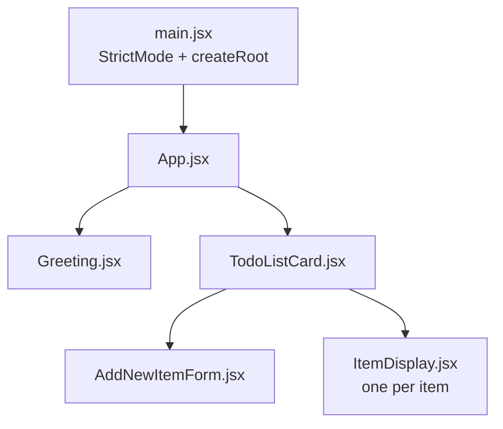

# Exploring the Frontend from the Outside In (with DevTools)

> **Prerequisite:** you must have finished `api-exploration-with-bruno.md`. This guide
> constantly refers back to what you proved there. Without it, half the findings here will
> not land.
>
> **Who this is for:** someone who has sent HTTP requests by hand but has never opened the
> Network tab on purpose, and has never read a React component looking for defects.
>
> **Time:** 2–3 hours. Keep Bruno open the whole time — you will need it.

---

## What you will be able to do at the end

1. Watch a click turn into an HTTP request, and name every step in between.
2. Read a React component and say exactly which endpoint it calls and when.
3. Explain where the app's data lives, and prove it can disagree with the database.
4. Find at least four defects in the frontend, three of which are only visible **because**
   you already know how the API behaves.

Same ground rule as last time: **predict before you run.** Write down what you expect, then
look. The gap is where the learning is.

---

# Stage 0 — What you already know, from the other side

In the Bruno exercise you were the client. You typed the requests. Now you get to watch a
real client make the exact same requests, and find out whether it makes them the way you
would have.

The whole frontend is **five files**, and it maps onto the API with almost suspicious
tidiness:



**Five endpoints. Five `fetch` calls. One per component responsibility.** Fill in the last
column from memory before you open anything:

| Endpoint | Component | Line | What the user did to trigger it |
| --- | --- | --- | --- |
| `GET /api/greeting` | `Greeting.jsx` | `:7` | |
| `GET /api/items` | `TodoListCard.jsx` | `:9` | |
| `POST /api/items` | `AddNewItemForm.jsx` | `:21` | |
| `PUT /api/items/:id` | `ItemDisplay.jsx` | `:14` | |
| `DELETE /api/items/:id` | `ItemDisplay.jsx` | `:27` | |

There is no API client layer, no service module, no state library. **Every component talks
to the network directly with raw `fetch`.** Note that as an architectural fact now; we will
come back to whether it is a good idea.

### One question before you touch DevTools

Open `client/vite.config.js`. The entire file:

```js
export default defineConfig({
    plugins: [react()],
});
```

There is **no proxy configuration.** Yet `fetch('/api/items')` in the React app reaches the
Express backend.

| Question | Your answer |
| --- | --- |
| If Vite is not proxying `/api`, what is? | |
| Which file configures it, and on which line? | |

If you cannot answer this, go back to Stage 0 of the Bruno guide. **This is the single most
misunderstood part of the whole stack**, and every developer who skips it eventually loses a
day to it.

---

# Stage 1 — The Network tab

Start the app if it is not running:

```bash
docker compose up --watch
```

Open http://localhost, then open DevTools (`F12`, or `Ctrl+Shift+I`). Go to the **Network**
tab.

Configure it before doing anything else — these three settings save you constant confusion:

| Setting | Why |
| --- | --- |
| Filter: **Fetch/XHR** | Hides images, CSS, fonts, and Vite's own machinery. You only want API calls. |
| **Preserve log** ✅ | Otherwise the list clears on every reload and you lose the evidence. |
| **Disable cache** ✅ | Guarantees you are watching real requests, not the browser's memory. |

Click any request and you get panes that are the exact counterparts of Bruno's:

| Bruno | DevTools |
| --- | --- |
| The request you typed | **Headers** → General + Request Headers |
| Body tab | **Payload** |
| Response pane | **Response** |
| Response headers | **Headers** → Response Headers |
| — | **Timing** (Bruno has no equivalent) |

**The Network tab is Bruno in reverse.** In Bruno you authored requests and read responses.
Here you read requests somebody else authored. Same protocol, same fields, opposite
direction.

---

# Stage 2 — What happens on page load

Reload the page with the Network tab open and Fetch/XHR filtered.

**Predict first.** Read `Greeting.jsx:6-10` and `TodoListCard.jsx:8-12`. Both have a
`useEffect` that fires on mount.

| Question | Your prediction | Actual |
| --- | --- | --- |
| How many API requests on a fresh page load? | | |
| Which endpoints? | | |
| In what order? | | |

Most people confidently predict two. **Count what you actually see.**

### If you saw more than you expected

Open `client/src/main.jsx`:

```jsx
ReactDOM.createRoot(document.getElementById('root')).render(
    <React.StrictMode>
        <App />
    </React.StrictMode>,
);
```

`React.StrictMode` deliberately **mounts every component twice in development** — it runs
each effect, tears it down, and runs it again. It is looking for effects that break when run
more than once, which is a real and common class of bug.

So both `useEffect` hooks fire twice, and you get double the requests.

**This is not a bug, and it does not happen in the production build.** But it teaches you
three things at once:

1. `useEffect` is not a guarantee of "runs exactly once."
2. Development and production behave differently, so *"it worked on my machine"* has a
   mechanism behind it.
3. **If a `useEffect` sent a `POST`, StrictMode would create two rows.** Reading is safe to
   repeat; writing is not.

| Question | Your answer |
| --- | --- |
| Which of the five `fetch` calls are inside a `useEffect`? | |
| Are any of them non-`GET`? | |
| Why does that matter for StrictMode? | |

### A detail for the sharp-eyed

`Greeting.jsx:10` ends its `useEffect` with the dependency array `[setGreeting]`, while
`TodoListCard.jsx:12` uses `[]`. Both effectively run on mount only, because React
guarantees the identity of a `useState` setter is stable across renders.

So the two are equivalent — but one of them **states a dependency it does not actually
depend on**, which misleads the next reader. Note it as a code-quality observation, not a
defect.

---

# Stage 3 — Map every action to its request

Do each action in the browser and watch the request appear. For each one, before clicking,
read the component and predict the method, the URL, and the body.

## 3.1 — Add an item

Type a name and click **Add Item**. Read `AddNewItemForm.jsx:11-28` first.

| Question | Your prediction | Actual |
| --- | --- | --- |
| Method and URL? | | |
| Request body (Payload tab)? | | |
| `Content-Type` header? | | |
| What does the app do with the response? | | |

Two things worth stopping on.

**The `Content-Type` header is set by hand** at `AddNewItemForm.jsx:18`. It is not
automatic. Remember from the Bruno exercise that `express.json()` only parses a body when
that header says `application/json` — so this line is what makes the backend able to read the
body at all. **Client and server are honouring a contract, and this header is the contract.**

**`e.preventDefault()` at line 12.** Delete that line mentally and predict what happens: an
HTML form's default submit action is a full page navigation. The whole app would reload.
Every single-page app calls this, and most people who write it cannot say why.

## 3.2 — Toggle an item complete

Click the checkbox. Read `ItemDisplay.jsx:13-24` **before** you look at the Payload.

```js
body: JSON.stringify({
    name: item.name,
    completed: !item.completed,
}),
```

| Question | Your answer |
| --- | --- |
| You only changed `completed`. Why does the request also send `name`? | |
| What did you prove in Bruno about a `PUT` that omits `name`? | |
| Is this the frontend's problem to solve, or the API's? | |

**Stop here and make sure this one has landed, because it is the most important finding in
this guide.**

The frontend sends a field it did not change, because the API destroys any field you omit.
You proved that yourself with Bruno — it was defect #2. The client is **compensating for a
defect in the API**, and nothing in the code says so. No comment, no documentation, no test.

Now ask the real question: what happens when a *second* client gets written — a mobile app,
a script, a colleague's integration? They will not know about this rule. They will send
`{"completed": true}`, the way any reasonable person would, and they will silently wipe
users' item names.

**An undocumented workaround in one client is not a fix. It is a bug with a longer fuse.**

## 3.3 — Delete an item

Click the trash icon. Read `ItemDisplay.jsx:26-30`.

| Question | Your prediction | Actual |
| --- | --- | --- |
| Method and URL? | | |
| Is there a request body? | | |
| Response status and body? | | |
| Does the app read the response at all? | | |

Look closely at line 27: `.then(() => onItemRemoval(item))`. The callback **ignores its
argument entirely.** The app does not care what the server said — only that it replied.

| Question | Your answer |
| --- | --- |
| If the delete failed with a 500, would the item disappear from the screen anyway? | |
| Trace the code to justify your answer. | |

---

# Stage 4 — Where the data actually lives

Install the **React Developer Tools** browser extension, then open the new **Components**
tab. Select `TodoListCard` and look at its hooks in the right-hand panel. You are looking at
the array of items in memory.

Now read `TodoListCard.jsx` again, all 59 lines, and pay attention to what it does *after*
each action:

```js
const onNewItem = useCallback((newItem) => {
    setItems([...items, newItem]);
}, [items]);
```

| Question | Your answer |
| --- | --- |
| After adding an item, does the app re-fetch `GET /api/items`? | |
| After toggling one? After deleting one? | |
| How many times is `GET /api/items` called in an entire session? | |

The answer to the last one is: **once, on mount.** Forever after, the list on your screen is
a copy that the browser maintains by hand — appending, replacing by index, splicing.

That is a legitimate and common design. It is fast, and it avoids a network round-trip on
every change. But it has a precise cost, and now you are going to prove it.

---

# Stage 5 — Making the screen lie

This experiment needs **Bruno and the browser side by side.** This is why you learned Bruno
first.

1. In the browser, add three items. Leave the page open. **Do not reload it.**
2. In Bruno, send `GET /api/items` and confirm all three are there.
3. In Bruno, `DELETE` the middle one.
4. In Bruno, `PUT` a completely new `name` onto the first one.
5. Now look back at the browser. **Do not reload.**

| Question | Your answer |
| --- | --- |
| What does the screen show? | | 
| What is actually in the database? | |
| How long would the screen keep lying? | |
| What would make it tell the truth again? | |

You have just produced, on demand, the defect behind a huge share of real support tickets:
**two sources of truth that have drifted apart.** The server has one answer, the browser has
another, and nothing in the system notices or reconciles them.

Now click the checkbox on the item you deleted in Bruno.

| Question | Your prediction | Actual |
| --- | --- | --- |
| What request goes out? | | |
| What status comes back? | | |
| What does the screen do? | | |
| What *should* it have done? | | |

Trace it through the code before you decide: `ItemDisplay.jsx:21-23` calls `.then(r => r.json())` and hands the parsed result to `onItemUpdate`. Look at what `PUT` on a nonexistent id returns — you recorded that in the Bruno exercise as defect #4. Then read `onItemUpdate` at `TodoListCard.jsx:21-31` and follow what happens when `findIndex` does not find the id.

Record what you observe, then **explain the mechanism.** Observation alone is not the answer.

---

# Stage 6 — Breaking the network on purpose

Every user of every app has bad connectivity sometimes. Let us see what this one does.

## 6.1 — Kill the backend

```bash
docker compose stop backend
```

Now reload the page.

| Question | Your prediction | Actual |
| --- | --- | --- |
| What does the page show? | | |
| Is there any error message? | | |
| What does the Network tab show for the two requests? | | |
| Does the greeting heading appear? | | |

Read `TodoListCard.jsx:41` and `Greeting.jsx:12`:

```js
if (items === null) return 'Loading...';   // TodoListCard
if (!greeting) return null;                // Greeting
```

Now search the whole `client/src` folder for `.catch`:

```bash
rg '\.catch' client/src
```

| Question | Your answer |
| --- | --- |
| How many `.catch` handlers are in the frontend? | |
| So what state does a failed request leave the app in? | |
| From the user's point of view, is that state distinguishable from "slow"? | |

**"Loading…" forever is a lie.** Nothing is loading. The request failed and no one is coming.
The app has no vocabulary for failure — its only two states are *no data yet* and *data*.
And `Greeting` is worse: it renders `null`, so the failure is completely invisible.

Bring the backend back:

```bash
docker compose start backend
```

## 6.2 — Fail a write instead of a read

With the app loaded and working, stop the backend again, then — **without reloading** — type a
name and click **Add Item**.

| Question | Your prediction | Actual |
| --- | --- | --- |
| What does the button say after you click? | | |
| Does the text ever change back? | | |
| Does the typed name get cleared? | | |
| Can you tell whether the item was created? | | |

Read `AddNewItemForm.jsx:11-28` and trace the state. `setSubmitting(true)` happens on line
13, unconditionally. `setSubmitting(false)` happens **only** inside `.then()`, on line 25.

| Question | Your answer |
| --- | --- |
| On failure, which line resets `submitting`? | |
| So what does the button say, permanently? | |
| What must the user do to escape that state? | |

**This is a defect you can find by reading, without running anything.** A state flag set
before an async call and cleared only on the success path will get stuck on every failure.
It is one of the most common bugs in frontend code, and now you have seen it in the wild.

## 6.3 — Slow, not broken

Restart the backend. In the Network tab, set throttling from **No throttling** to **Slow 3G**,
then reload.

| Question | Your answer |
| --- | --- |
| How long does "Loading..." stay on screen? | |
| Is there any spinner, skeleton, or progress indication? | |
| Now click **Add Item** twice, quickly. How many `POST` requests go out? | |

That last question deserves its own section.

---

# Stage 7 — The double submit

Read these two lines from `AddNewItemForm.jsx:40-47` very carefully:

```jsx
<Button
    type="submit"
    variant="success"
    disabled={!newItem.length}
    className={submitting ? 'disabled' : ''}
>
```

There are two different mechanisms here and only one of them actually disables anything.

- `disabled={!newItem.length}` is a **prop**. It sets the real HTML `disabled` attribute, and
  a disabled button does not fire click events.
- `className={submitting ? 'disabled' : ''}` is a **CSS class**. Bootstrap styles it to
  *look* faded.

Now reason it through. While a submit is in flight, `submitting` is `true` — but `newItem`
still holds the typed text, because it is only cleared inside `.then()` on line 26. So
`!newItem.length` is `false`, so the `disabled` prop is `false`.

| Question | Your prediction | Actual |
| --- | --- | --- |
| Is the button clickable while a submit is in flight? | | |
| With Slow 3G on, how many `POST`s can you fire from one typed name? | | |
| How many rows appear in phpMyAdmin? | | |

Verify it in the Network tab and in phpMyAdmin, then say plainly whether the button is
protected or merely painted to look protected.

**A control that looks disabled but is not is worse than one that looks enabled**, because
the user trusts what they see and the developer trusts the CSS.

---

# Stage 8 — The Elements tab

Switch to the **Elements** tab and inspect one of the todo rows. Look at the `class`
attribute on the outer `div`.

Then read `ItemDisplay.jsx:33`:

```jsx
<Container fluid className={`item ${item.completed && 'completed'}`}>
```

| Question | Your answer |
| --- | --- |
| For a completed item, what is the class attribute? | |
| For an **incomplete** item, what is it? | |
| Why? Walk through what `false && 'completed'` evaluates to, then what a template literal does with that value. | |

You should find a CSS class in your live DOM with a name that nobody ever intended to write.
It is harmless — no stylesheet matches it — but it is the visible fingerprint of a
JavaScript coercion rule, and finding it yourself in the Elements tab is worth more than
reading about truthiness in a blog post.

This is the same family of bug as `completed: "false"` from the Bruno exercise. **JavaScript
will convert almost anything into almost anything rather than complain.**

While you are here, notice something done *well*: `ItemDisplay.jsx:41-45` and `:65` set real
`aria-label` values that change with state (`"Mark item as complete"` versus `"Mark item as
incomplete"`). A screen reader user can operate this app. That is a deliberate, competent
choice and it deserves to be recognised as much as the defects deserve to be found.

---

# Stage 9 — The defect table

Same rules as last time: every row needs a request you sent or a state you produced. **"It
seems wrong" is not evidence.**

| # | Defect | Where | Evidence | Correct behavior |
| --- | --- | --- | --- | --- |
| 1 | No error handling anywhere; failures look like loading | all 5 `fetch` calls | | |
| 2 | `submitting` never resets on failure | `AddNewItemForm.jsx:13,25` | | |
| 3 | Button looks disabled but is clickable → double submit | `AddNewItemForm.jsx:43-44` | | |
| 4 | Local state never reconciles with the server | `TodoListCard.jsx` | | |
| 5 | `PUT` resends `name` to work around an API defect, undocumented | `ItemDisplay.jsx:16-19` | | |
| 6 | Delete updates the UI without checking the response | `ItemDisplay.jsx:27` | | |
| 7 | Stray `false` class in the DOM | `ItemDisplay.jsx:33` | | |
| 8 | The only input validation is a button prop | `AddNewItemForm.jsx:43` | | |

## The two questions that matter

**First:** defect #8. In the Bruno exercise you sent `POST /api/items` with an empty body and
the API accepted it. Here, the UI prevents empty names with `disabled={!newItem.length}`.

| Question | Your answer |
| --- | --- |
| So does this system validate input, or not? | |
| Which layer is doing it? | |
| Who controls that layer — you, or whoever is using the app? | |
| Write the shortest possible explanation of why frontend validation is not validation. | |

Frontend validation is a **convenience for honest users**. It is not a defence. Anyone with
DevTools, `curl`, or Bruno — which is now all three of you — walks straight past it. You have
already done it.

**Second:** look at defects #1 through #6 together. Every one of them is a decision that was
never made — no error path, no reconciliation, no request-in-flight guard. Nobody chose to
omit them; the code simply never considered failure at all.

| Question | Your answer |
| --- | --- |
| Name the one habit that would have prevented most of this table. | |

---

# Stage 10 — Checkpoint

Close everything. Answer from understanding, out loud.

1. `fetch('/api/items')` has no hostname and `vite.config.js` has no proxy. Explain, hop by hop, how that request reaches Express.
2. Why does a fresh page load produce more requests than there are `useEffect` hooks?
3. Why would that same behavior be dangerous if one of those effects sent a `POST`?
4. Which component holds the list of items, and how many times does the app ask the server for it?
5. Describe how to make the screen disagree with the database, and how to make it agree again.
6. Why does the toggle request send `name` when only `completed` changed? What does that tell you about the API?
7. A user clicks **Add Item** and the network fails. Describe precisely what they see, and why they see it.
8. What is the difference between the `disabled` prop and a `disabled` CSS class?
9. Where is input validated in this system, and why does that not count as validation?
10. Name one thing this frontend does genuinely well.

**Question 10 is not filler.** Learning to review code means learning to recognise competence,
not only failure. An engineer who can only find faults is half an engineer.

If you cannot answer all ten without looking, stay here. **Concepts before code. Always.**

---

# Commit your findings

```bash
git checkout -b docs/frontend-exploration-findings
git add docs
git commit -m "docs: record frontend exploration findings"
```

---

## Appendix — the frontend on one page

| File | Responsibility | Network calls |
| --- | --- | --- |
| `client/src/main.jsx` | Mounts React inside `StrictMode` | — |
| `client/src/App.jsx` | Layout only — Bootstrap grid | — |
| `client/src/components/Greeting.jsx` | Fetches and shows the heading | `GET /api/greeting` |
| `client/src/components/TodoListCard.jsx` | Owns the item list state | `GET /api/items` |
| `client/src/components/AddNewItemForm.jsx` | New-item form | `POST /api/items` |
| `client/src/components/ItemDisplay.jsx` | One row: toggle and delete | `PUT`, `DELETE /api/items/:id` |
| `client/vite.config.js` | Vite + React plugin. **No proxy** | — |

**Stack:** React 19, Vite 6, react-bootstrap 2, Sass, FontAwesome, PropTypes for type
checking. No router, no state management library, no data-fetching library, no API client
layer — `fetch` is called directly inside each component.

**Keep that last sentence in mind.** When you eventually build the FastAPI version, the
question "where should the code that talks to the network live?" will come back — and by then
you will have felt the cost of the answer this app chose.
